# 👋 Hey there! I'm Pasindu Randima

<div align="center">
  


</div>

<div align="center">

### 🚀 Passionate Full Stack Developer | 💡 Innovation Enthusiast | 🌍 Open Source Contributor

[](https://yourportfolio.com)
[](https://linkedin.com/in/yourprofile)
[](https://twitter.com/yourhandle)
[](https://instagram.com/yourhandle)

</div>

---

## 🎭 About Me

```javascript
const developer = {
    name: "Your Name",
    location: "Your City, Country",
    role: "Full Stack Developer",
    workingOn: "Building amazing web applications",
    learning: ["Web3", "Machine Learning", "Cloud Architecture"],
    askMeAbout: ["React", "Node.js", "Python", "System Design"],
    funFact: "I debug with console.log and I'm not ashamed! 🐛",
    coffee: "☕ Coffee.exe has stopped working... please restart"
};
```


- 🔭 Currently working on **Full Stack Web Applications**
- 🌱 Learning **Cloud Architecture & DevOps**
- 👯 Looking to collaborate on **Open Source Projects**
- 🤔 Seeking help with **System Design & Scalability**
- 💬 Ask me about **React, Node.js, Python, or anything tech**
- 📫 Reach me at: **your.email@gmail.com**
- ⚡ Fun fact: **I think semicolons in JavaScript are optional** 😄

---

## 🛠️ Tech Arsenal

### Frontend Technologies
<div align="center">


</div>

### Backend Technologies
<div align="center">


</div>

### Database & Cloud
<div align="center">


</div>

### Tools & Development
<div align="center">


</div>

---

## 🎨 Featured Projects

<div align="center">

### 🌟 Project Showcase

</div>

<table>
<tr>
<td width="50%">

### 🚀 E-Commerce Platform
**Full Stack MERN Application**

[](https://your-ecommerce-demo.com)
[](https://github.com/yourusername/ecommerce)

- 🛍️ Modern shopping cart with real-time updates
- 💳 Stripe payment integration
- 📱 Responsive design for all devices
- 🔐 JWT authentication & authorization
- 📊 Admin dashboard with analytics

**Tech Stack:** React, Node.js, MongoDB, Stripe API

</td>
<td width="50%">

### 📱 Social Media Dashboard
**Real-time Analytics Platform**

[](https://your-dashboard-demo.com)
[](https://github.com/yourusername/dashboard)

- 📈 Real-time data visualization
- 🔄 Auto-refresh dashboard
- 📊 Interactive charts with Chart.js
- 🌙 Dark/Light mode toggle
- 📲 PWA functionality

**Tech Stack:** Vue.js, Python, FastAPI, WebSocket

</td>
</tr>

<tr>
<td width="50%">

### 🏠 Real Estate Platform
**Property Management System**

[](https://your-realestate-demo.com)
[](https://github.com/yourusername/realestate)

- 🏡 Property listing with advanced search
- 🗺️ Interactive maps integration
- 📸 Image gallery with lazy loading
- 💌 Contact form with email notifications
- 🔍 SEO optimized pages

**Tech Stack:** Next.js, TypeScript, PostgreSQL, AWS S3

</td>
<td width="50%">

### 🎵 Music Streaming App
**Full Stack Audio Platform**

[](https://your-music-demo.com)
[](https://github.com/yourusername/musicapp)

- 🎶 Audio streaming with custom player
- 🎧 Playlist creation and management
- 👥 Social features and sharing
- 🔊 Audio visualization
- 📱 Mobile-first design

**Tech Stack:** Angular, Node.js, MongoDB, Socket.io

</td>
</tr>
</table>

---

## 📊 GitHub Analytics

<div align="center">


</div>

<div align="center">


</div>

<div align="center">

### 🏆 GitHub Profile Trophy
[](https://github.com/ryo-ma/github-profile-trophy)

</div>

---

## 📈 Contribution Graph

<div align="center">

[](https://github.com/yourusername)

</div>

---

## 🎯 Current Focus

```mermaid
graph TD
    A[🚀 Current Goals] --> B[📱 Mobile Development]
    A --> C[☁️ Cloud Architecture]
    A --> D[🤖 AI/ML Integration]
    A --> E[🔐 Cybersecurity]
    
    B --> F[React Native]
    B --> G[Flutter]
    
    C --> H[AWS Solutions]
    C --> I[Kubernetes]
    
    D --> J[TensorFlow]
    D --> K[OpenAI API]
    
    E --> L[Security Best Practices]
    E --> M[Penetration Testing]

    style A fill:#6366f1,stroke:#4338ca,stroke-width:3px,color:#fff
    style B fill:#8b5cf6,stroke:#7c3aed,stroke-width:2px,color:#fff
    style C fill:#06b6d4,stroke:#0891b2,stroke-width:2px,color:#fff
    style D fill:#10b981,stroke:#059669,stroke-width:2px,color:#fff
    style E fill:#f59e0b,stroke:#d97706,stroke-width:2px,color:#fff
```

<div align="center">



</div>

---

## 🏅 Achievements & Certifications

<div align="center">

| 🏆 Achievement | 📅 Year | 🎯 Focus Area |
|---|---|---|
| AWS Certified Solutions Architect | 2023 | Cloud Computing |
| Google Cloud Professional | 2023 | Cloud Architecture |
| Meta React Advanced Developer | 2022 | Frontend Development |
| MongoDB Certified Developer | 2022 | Database Management |
| Docker Certified Associate | 2021 | DevOps & Containerization |

</div>

---

## 🌟 Open Source Contributions

<div align="center">

### 💡 Contributing to the Community

[](https://github.com/ellerbrock/open-source-badges/)
[](http://makeapullrequest.com)

</div>

```yaml
contributions:
  total_repos: 50+
  pull_requests: 200+
  issues_resolved: 150+
  languages:
    - JavaScript/TypeScript
    - Python
    - Java
    - Go
  focus_areas:
    - Frontend Frameworks
    - Backend APIs
    - DevOps Tools
    - Documentation
```

### 🎯 Notable Contributions

- 🔧 **React Router** - Fixed routing edge cases
- 🌐 **Next.js** - Contributed to documentation
- 🐍 **FastAPI** - Added new middleware features
- 📊 **Chart.js** - Performance optimizations
- 🎨 **Tailwind CSS** - New utility classes

---

## 💻 Development Setup

<details>
<summary>🛠️ Click to see my development environment</summary>

### Hardware
- 💻 MacBook Pro M2 16" (2023)
- 🖥️ Dell UltraSharp 4K Monitor
- ⌨️ Mechanical Keyboard (Cherry MX Blue)
- 🖱️ Logitech MX Master 3

### Software
- **Editor:** VS Code with 20+ extensions
- **Terminal:** iTerm2 with Oh My Zsh
- **Browser:** Chrome DevTools
- **Design:** Figma, Adobe Creative Suite
- **Database:** MongoDB Compass, pgAdmin

### VS Code Extensions
```json
{
  "favorites": [
    "ES7+ React/Redux/React-Native snippets",
    "Auto Rename Tag",
    "Prettier - Code formatter",
    "GitLens",
    "Thunder Client",
    "Live Server",
    "Bracket Pair Colorizer",
    "Material Icon Theme"
  ]
}
```

</details>

---

## 📚 Learning Journey

<div align="center">

### 🎯 2024 Learning Goals

</div>

- [ ] 🧠 **Machine Learning** - TensorFlow & PyTorch
- [ ] 🌐 **Web3** - Blockchain & Smart Contracts
- [ ] 📱 **Mobile Development** - React Native & Flutter
- [ ] ☁️ **Advanced Cloud** - Multi-cloud architecture
- [ ] 🔒 **Cybersecurity** - Ethical hacking & penetration testing
- [ ] 🎨 **3D Graphics** - Three.js & WebGL

### 📖 Currently Reading
- "System Design Interview" by Alex Xu
- "Clean Architecture" by Robert C. Martin
- "Designing Data-Intensive Applications" by Martin Kleppmann

---

## 🎨 Fun Stuff

<div align="center">

### 🎭 When I'm Not Coding

</div>

```javascript
const myLife = {
  workHardPlayHard: true,
  hobbies: ['🎮 Gaming', '📸 Photography', '🏃‍♂️ Running', '🎵 Music'],
  favoriteCoffee: 'Espresso ☕',
  currentlyPlaying: 'Cyberpunk 2077 🎮',
  favoriteQuote: '"Code is like humor. When you have to explain it, it\'s bad." – Cory House'
};

while (alive) {
  eat();
  sleep();
  code();
  repeat();
}
```

### 🎵 Currently Vibing To
[](https://open.spotify.com/user/yourusername)

---

## 📞 Let's Connect!

<div align="center">

### 💬 I'm always excited to connect with fellow developers!

Whether you want to discuss the latest tech trends, collaborate on a project, or just chat about code, feel free to reach out!

[](mailto:your.email@gmail.com)
[](https://linkedin.com/in/yourprofile)
[](https://twitter.com/yourhandle)
[](https://discord.gg/yourdiscord)
[](https://t.me/yourusername)

</div>

---

## 🎉 Fun Facts & Memes

<div align="center">

<details>
<summary>😄 Click for some developer humor!</summary>

<br>

### 🐛 Developer Life
- ❌ 99% of my problems can be solved by restarting the server
- ✅ 99% of my problems can be solved by restarting the server
- 💡 "It works on my machine" - Every developer ever
- 🔥 There are only 10 types of people: those who understand binary and those who don't
- ⚡ Programming is 10% writing code and 90% figuring out why it doesn't work

### 🎯 Developer Levels
```
Junior Dev: "I don't know what I'm doing" 😰
Mid Dev: "I know exactly what I'm doing" 😎 
Senior Dev: "I don't know what I'm doing" 🤔
```

</details>

</div>

---

<div align="center">

### ⭐ If you made it this far, you're awesome! ⭐


[](https://github.com/yourusername)

---

**✨ "The best way to predict the future is to implement it." - Alan Kay ✨**

*Thanks for visiting my profile! Have a great day! 🌟*

</div>
